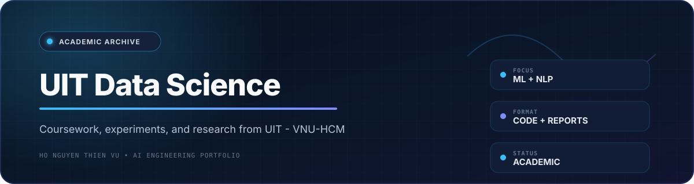

<div align="center">
  
  <br /><br />

  
  
  
  
</div>

## Overview

**UIT_DS** is a curated archive of coursework, experiments, reports, and academic projects completed during my B.Sc. in Data Science at the **University of Information Technology (UIT), VNU-HCM**.

This repository shows the foundations behind my later AI engineering work: statistical learning, data exploration, visualization, natural language processing, and end-to-end software development.

> This is an academic archive. Standalone research and production-oriented systems are maintained in dedicated repositories on my [GitHub profile](https://github.com/thiennvu1914).

## Highlighted Work

| Course / Project | Focus | What It Demonstrates |
|---|---|---|
| **DS102 - Breast Cancer Classification** | Classical machine learning, PCA, model selection | Baseline design, dimensionality reduction, GridSearchCV, and comparative evaluation |
| **DS310 - Vietnamese Legal NLI** | Vietnamese legal-domain NLP | Dataset preparation, transformer evaluation, and domain-specific language understanding |
| **IE221 - Restaurant Management** | Django web application | Database design, backend development, frontend integration, and testing |

## Learning Areas


## Repository Map

| Directory | Subject Area | Typical Contents |
|---|---|---|
| `DS101/` | Statistical and computational foundations | Exercises, notes, and foundational implementations |
| `DS102/` | Statistical machine learning | Models, preprocessing, evaluation, and final project materials |
| `DS108/` | Data visualization | Exploratory analysis and visualization experiments |
| `DS310/` | NLP for Data Science | Vietnamese NLP and legal NLI work |
| `IE221/` | Python programming and web development | Django application source and documentation |

## What You Will Find Here

- Final projects and major assignments
- Source code, notebooks, and experiments
- Reports and presentation materials
- Exploratory data analysis and visualization
- Model comparisons and preprocessing studies
- Setup instructions where available

## Representative Structure

```text
UIT_DS/
├── DS101/        # Statistical and computational foundations
├── DS102/        # Statistical machine learning
├── DS108/        # Data visualization
├── DS310/        # NLP for Data Science
├── IE221/        # Python and web development
└── README.md     # Repository overview
```

## Notes

- Individual folders may use different dependency versions because they were completed in different semesters.
- Academic reports may describe historical results and should not be interpreted as current production benchmarks.
- For the clearest evaluation of my current engineering work, start with the featured repositories on my profile.

---

<div align="center">
  <strong>From academic foundations to production-oriented AI engineering.</strong><br />
  <a href="https://github.com/thiennvu1914">Explore my GitHub profile</a>
</div>
